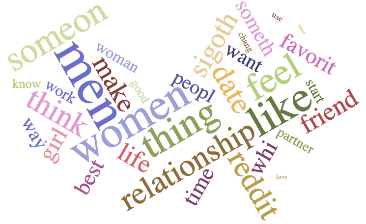

# AskWomen-AskMen-Classification
### Authored by : Sean Bjork

## Problem Statement
- Can questions asked on subreddit threads AskWomen and AskMen be classified with accuracy over 70%
- To solve this problem, we conduct vectorization with CountVectorizer and TFIDF. We model our resulting data frames using LogisticRegression with LASSO regularization and Multinomial Naive Bayes. The target variable for this analysis is the source of the question: AskWomen (1) or AskMen (0).

## Data
- 1269 rows (posts) collected from Reddit.com, specifically reddit.com/r/AskWomen and reddit.com/r/AskMen.

- Roughly even distribution from each: 684 from AskWomen (54%) and 585 from AskMen (46%).

  - The higher of these, 54%, acts as our naive prediction (simplest model which predicts majority class at 100%).
 

## Repository Structure
- Jupyter Notebooks:
  - (./code/1_scraping.ipynb)
  - (./code/2_cleaning.ipynb)
  - (./code/3_NLP_EDA.ipynb)
  - (./code/4_modeling_cvec.ipynb)
  - (./code/5_modeling_tfidf.ipynb)
- Datasets:
  - (./data/data.csv)
  - (./data/clean_data.csv)
  - (./data/cvec_df.csv)
  - (./data/tfidf_df.csv)
- Presentation:
  - (./slides/AskWomen_AskMen_Classification.pdf)
- Pictures:
  - (./pictures/overlap_words.png)

## Executive Summary
Our data was collected from multiple requests to our desired Reddit APIs. Of the keys provided in these dictionaries, we were most interested by "title", which contained the question for each post and contained zero missing values. Cleaning our data entailed removing undesired special characters (mostly "#" and "\") and replacing the commonly used abbreviation "SO" with "sigoth", short for "significant other". For natural language processing, we employed both the CountVectorizer and TFIDF, creating data frames labeled "cvec_df.csv" and "tfidf_df.csv". We added "target" columns to these data frames to conclude our preprocessing.

For the modeling of our data, we used both LogisticRegression and Multinomial Naive Bayes with both vectorized data frames. Utilizing GridSearchCV, we found the best hyperparameters for each model. For LogisticRegression, the best "penalty" (regularizer) was found to be Lasso. However, the best accuracy score from this model (.664) was less than the best found with Naive Bayes. It is interesting to note that the Naive Bayes calculations occured much more quickly, as GridSearching hundreds of alpha-values took mere seconds.

## Findings/Conclusions
In this study, we found lists of words which occur frequently in both AskWomen and AskMen, as well as words which occur in one of the subreddits or the other. The words in these latter two lists effectively serve as the best-predicting features for our models. Our accuracy score (.664) is significantly greater than the naive prediction accuracy (.539).

## Recommendations/Future Steps
For further research, we encourage the collection of more data and vectorizing within the gridsearch to improve hyperparameter tuning. Also, feature engineering which included character and word counts, as well as incorporation of the 'text' feature from posts that included it, may improve modeling performance.

## References
Data:
- https://reddit.com/r/AskWomen.json
- https://reddit.com/r/AskMen.json
